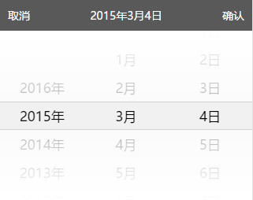

# IOS PickerControl


### 此插件依赖于 `jQuery` 或 `Zepto`

## 示例
```javascript
var pickerControl = PickerControl({
	dom: $('#picker-control'),
	count: 2,
	itemHeight: 36,
	maskSize: 90,
	changedEvent: function (data) {
		console.log(data)
	},
	cancelEvent: function () {
		console.log('cancel')
	},
	confirmEvent: function (data) {
		console.log(data)
	}
})
```

## 参数说明
`dom`: PickerControl 所在的 $ 对象  
`count`: 所包含选择的列数  
`itemHeight`: 每条选项的高度  
`maskSize`: 半透明遮挡的高度  
`changedEvent`: 选项改变时所触发的回调  
>参数结构
```javascript
{
	pickerIndex: index, // 列的索引
	itemIndex: itemIndex, // 选项的索引
	data: listData[index][itemIndex] // 所选项包含的数据 {value: ,text: }
}
```
`cancelEvent`: 取消按钮的回调  
`confirmEvent`: 确定按钮的回调  

## 接口说明
`setItems(index, [{value: ,text: },...])`: 列的索引和数据集合  
`setSelected(index, itemIndex)`: 列的索引和选项的索引  
`getPickedData(index)`: 列选中的数据 {value: ,text: } 格式  
`getItemLength(index)`: 当前列的选项个数  
`getSelectedIndex(index)`: 当前列选中项的索引  

## HTML 结构
```html
<div class="picker-control" id="picker-control">
	<div class="picker-bar">
		<div class="bar-button left">取消</div>
		<div class="bar-button right">确认</div>
	</div>
	<div class="pickers picker-2">
		<div class="picker">
			<div class="picker-list">
				<div class="picker-item" data-value="1">111</div>
				<div class="picker-item" data-value="2">222</div>
				<div class="picker-item" data-value="3">333</div>
				<div class="picker-item" data-value="4">444</div>
				<div class="picker-item" data-value="5">555</div>
				<div class="picker-item" data-value="6">666</div>
			</div>
			<div class="picker-mask up"></div>
			<div class="picker-view"></div>
			<div class="picker-mask down"></div>
		</div>
		<div class="picker">
			<div class="picker-list">
				<!--<div class="picker-item" data-value="value">text</div>-->
			</div>
			<div class="picker-mask up"></div>
			<div class="picker-view"></div>
			<div class="picker-mask down"></div>
		</div>
	</div>
</div>
```

## 